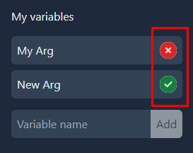
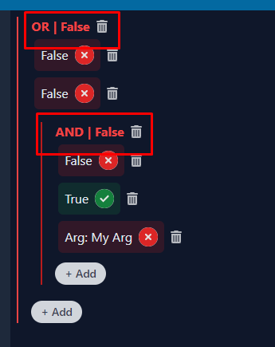
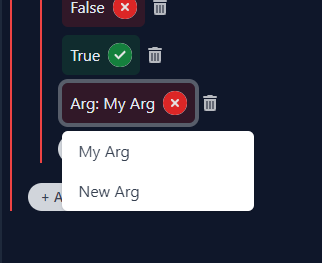

## Getting Started

First, run the development server:

```bash
npm i
npm run dev
```

## Instructions
1. Click on icons to toggle values from TRUE to FALSE to TRUE

1. Click on operator name to toggle the operator

2. Click on argument to select another argument from the list of arguments


## Test cases (Complex to simple)
1. Create an OR operation. This will add two constants with FALSE values. Add AND operation as an operand of our OR operation. Add an argument `My Arg` in addition to two default FALSE constants in our AND operation. Toggle all operands of AND operations to TRUE. Result will be TRUE.

1. Create an OR operation. This will add two constants with FALSE values. Add an argument `My Arg`. Toggle the value of the argument. Result will be TRUE or FALSE depending the value of `My Arg`.
1. Create an OR operation. This will add two constants with FALSE values. Toggle one of the constants to TRUE. Click on the operator name to toggle the operator from OR to AND to OR. Result will be TRUE for the OR operation and FALSE for the AND operation

1. Add an argument. Toggle the value of argument. Result will be TRUE or FALSE depending the value of the argument

1. Add an constant. Toggle the value of constant. Result will be TRUE or FALSE depending the value of the constant
